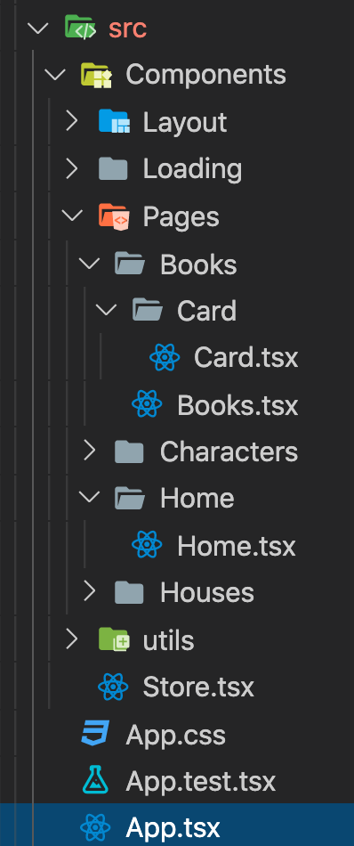

# Getting Started with Create React App

This project was bootstrapped with [Create React App](https://github.com/facebook/create-react-app).

- unstated-next (redux like)
- css material-ui
- react router

### `yarn start`


```
git clone ...
yarn install
yarn start
```

2 main pages :
- Home
- Books

- utils for interface et function
- Store : for redux

- (Characters and Houses are in progress)
- no time for test too



### `yarn test`

No time for testing

### `yarn build`

